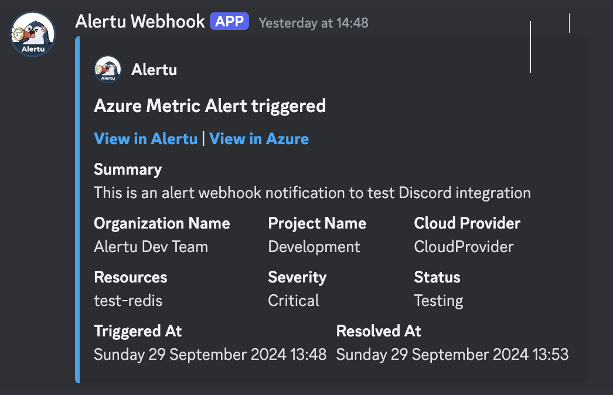
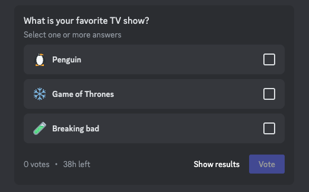

# Discord Examples



```csharp
using Hooki.Discord.Enums;
using Hooki.Discord.Models.BuildingBlocks;
using Hooki.Discord.Models;

return new DiscordWebhookPayload
{
    Username = "Alertu Webhook",
    AvatarUrl = "https://res.cloudinary.com/deknqhm9k/image/upload/v1727617327/Social2_bvec22.png",
    Embeds = new List<Embed>
    {
        new Embed
        {
            Author = new EmbedAuthor
            {
                Name = "Alertu",
                Url = "https://alertu.io",
                IconUrl = "https://res.cloudinary.com/deknqhm9k/image/upload/v1727617327/Social2_bvec22.png"
            },
            Title = $"Azure Metric Alert triggered",
            Description = $"[**View in Alertu**](https://alertu.io) | [**View in Azure**](https://portal.azure.com)",
            Color = 959721,
            Fields = new List<EmbedField>
            {
                new EmbedField { Name = "Summary", Value = "This is a test summary", Inline = false },
                new EmbedField { Name = "Organization Name", Value = "Test Organization", Inline = true },
                new EmbedField { Name = "Project Name", Value = "Test Project", Inline = true },
                new EmbedField { Name = "Cloud Provider", Value = "Azure", Inline = true },
                new EmbedField { Name = "Resources", Value = "test-redis, test-postgreSQL", Inline = true },
                new EmbedField { Name = "Severity", Value = "Critical", Inline = true },
                new EmbedField { Name = "Status", Value = "Open", Inline = true },
                new EmbedField { Name = "Triggered At", Value = DateTimeOffset.UtcNow.ToString("f"), Inline = true },
                new EmbedField { Name = "Resolved At", Value = DateTimeOffset.UtcNow.ToString("f"), Inline = true }
            }
        }
    }
};
```



```csharp
using Hooki.Discord.Models;
using Hooki.Discord.Models.BuildingBlocks;

var pollPayload = new DiscordWebhookPayload
{
    Poll = new PollCreateRequest
    {
        Question = new PollMedia
        {
            Text = "What is your favorite TV show?",
        },
        Duration = 24,
        AllowMultiSelect = true,
        Answers = new List<PollAnswer>
        {
            new PollAnswer
            {
                AnswerId = 1,
                PollMedia = new PollMedia
                {
                    Text = "Penguin",
                    Emoji = new Emoji { Name = "🐧" }
                }
            },
            new PollAnswer
            {
                AnswerId = 2,
                PollMedia = new PollMedia
                {
                    Text = "Game of Thrones",
                    Emoji = new Emoji { Name = "❄️" }
                }
            },
            new PollAnswer
            {
                AnswerId = 3,
                PollMedia = new PollMedia
                {
                    Text = "Breaking Bad",
                    Emoji = new Emoji { Name = "🧪" }
                }
            }
        }
    }
};
```

