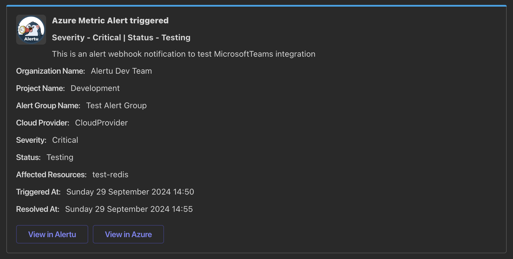

# Discord Examples



```csharp
return new MessageCard
{
    ThemeColor = "0x0EA5E9", // Light blue color
    Summary = "New Metric Alert: ALERT-001",
    Sections = new List<Section>
    {
        new Section
        {
            ActivityTitle = "**Azure Metric Alert triggered**",
            ActivitySubtitle = "**Severity - Critical | Status - Open**",
            ActivityText = "This is a test summary for the Azure Metric Alert",
            ActivityImage = "https://example-url/image.png",
            Facts = new List<Fact>
            {
                new Fact { Name = "Organization Name:", Value = "Test Organization" },
                new Fact { Name = "Project Name:", Value = "Test Project" },
                new Fact { Name = "Alert Group Name:", Value = "Test Alert Group" },
                new Fact { Name = "Cloud Provider:", Value = "Azure" },
                new Fact { Name = "Severity:", Value = "Critical" },
                new Fact { Name = "Status:", Value = "Open" },
                new Fact { Name = "Affected Resources:", Value = "test-redis, test-postgreSQL" },
                new Fact { Name = "Triggered At:", Value = DateTimeOffset.UtcNow.ToString("f") },
                new Fact { Name = "Resolved At:", Value = DateTimeOffset.UtcNow.ToString("f") }
            }
        }
    },
    PotentialActions = new List<ActionBase>
    {
        new OpenUriAction
        {
            Name = "View in Alertu",
            Targets = new List<Target>
            {
                new Target { OperatingSystem = "default", Uri = "https://alertu.io" }
            }
        },
        new OpenUriAction
        {
            Name = "View in Azure",
            Targets = new List<Target>
            {
                new Target { OperatingSystem = "default", Uri = "https://portal.azure.com" }
            }
        }
    }
};
```