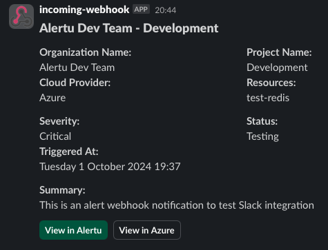

# Slack Examples



```csharp
using Hooki.Slack.Models;
using Hooki.Slack.Models.BlockElements;
using Hooki.Slack.Models.Blocks;
using Hooki.Slack.Models.CompositionObjects;

return new SlackWebhookPayload
{
    Blocks = new List<BlockBase>
    {
        new HeaderBlock
        {
            Text = new TextObject
            {
                Type = TextObjectTypes.PlainText,
                Text = $"Slack Webhook using Slack Block Kit"
            }
        },
        new SectionBlock
        {
            Fields =
            [
                new TextObject { Type = TextObjectType.Markdown, Text = $"*Organization Name:*\nTest Organization Name" },
                new TextObject { Type = TextObjectType.Markdown, Text = $"*Project Name:*\nTest Project Name" },
                new TextObject { Type = TextObjectType.Markdown, Text = $"*Cloud Provider:*\nAzure Name" },
                new TextObject { Type = TextObjectType.Markdown, Text = $"*Resources:*\ntest-redis, test-postgreSQL" }
            ]
        },
        new SectionBlock
        {
            Fields =
            [
                new TextObject { Type = TextObjectType.Markdown, Text = $"*Severity:*\nCritical" },
                new TextObject { Type = TextObjectType.Markdown, Text = $"*Status:*\nOpen" },
                new TextObject { Type = TextObjectType.Markdown, Text = $"*Triggered At:*\n{DateTimeOffset.UtcNow.ToString("f")}" }
            ]
        },
        new SectionBlock
        {
            Text = new TextObject
            {
                Type = TextObjectType.Markdown,
                Text = $"*Summary:*\nTesting Slack Webhook"
            }
        },
        new ActionBlock
        {
            Elements =
            [
                new ButtonElement
                {
                    Text = new TextObject
                    {
                        Type = TextObjectType.PlainText,
                        Text = "View in Alertu"
                    },
                    Url = appUrl,
                    Style = "primary"
                },

                new ButtonElement
                {
                    Text = new TextObject
                    {
                        Type = TextObjectType.PlainText,
                        Text = $"View in Azure"
                    },
                    Url = alert.CloudUrl
                }
            ]
        }
    }
};
```